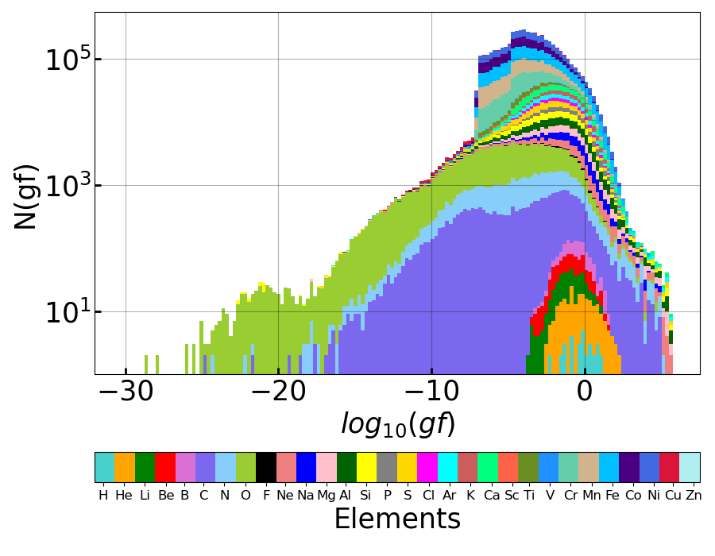

# Atomic-Database 

###### Total number of elements : 30
###### Maximum ionisation stage : 20
###### Maximum excitation level :  50
###### Total number of spectral line transition : 5174882

Our database contain information about line tranistions from various elements of the periodic table. The excitation level data is capped to a maximum excitation level of 50. The database is only valid under the assumption of Local thermodynamical equilibrium. The data has been obtained from Munich Atomic database, Chainti Atomic database, CMFGEN Atomic database and NIST Atomic database

###### Table contains the number of spectral lines from every element in the database

 Z | Element | Number of Ionization stages | Total Number of Spectral Lines
 :--:|:-------:|:---------------------------:|:------------------------------:
 1 |    H    |           1                 |               39
 2 |   He    |           2                 |              195
 3 |   Li    |           3                 |              262
 4 |   Be    |           4                 |              393
 5 |    B    |           5                 |              512
 6 |    C    |           6                 |            20740
 7 |    N    |           7                 |            27815
 8 |    O    |           8                 |           108663
 9 |    F    |           6                 |             2227
10 |   Ne    |          10                 |            26451
11 |   Na    |          11                 |            27367
12 |   Mg    |          12                 |            38091
13 |   Al    |          13                 |            59690
14 |   Si    |          14                 |            60337
15 |    P    |          15                 |            41019
16 |    S    |          16                 |            80355
17 |   Cl    |          17                 |            41222
18 |   Ar    |          18                 |            65321
19 |    K    |          19                 |            61855
20 |   Ca    |          20                 |           131236
21 |   Sc    |           3                 |            18461
22 |   Ti    |          10                 |            68216
23 |    V    |          10                 |             7313
24 |   Cr    |          20                 |           482654
25 |   Mn    |          20                 |           649914
26 |   Fe    |          20                 |          1034672
27 |   Co    |          20                 |           959399
28 |   Ni    |          20                 |          1098690
29 |   Cu    |           6                 |            60561
30 |   Zn    |           3                 |             1212

# Distribution of the strengths (gf) of the line transitions in our database

Line strengths are represented using a parameter called fcl -value, which is the classical oscillator strength. In several cases the fcl -value is scaled using the degenaracy of the lower level from which the transition takes place (g fl -value). This gives us the strenths of the lines (or gf parameter). The figure below displays the distribution of this gf parameter for every individual spectral line in our database. The figure is scaled logarithmically in both x and y axis. The colors represent the various elements in the database.

